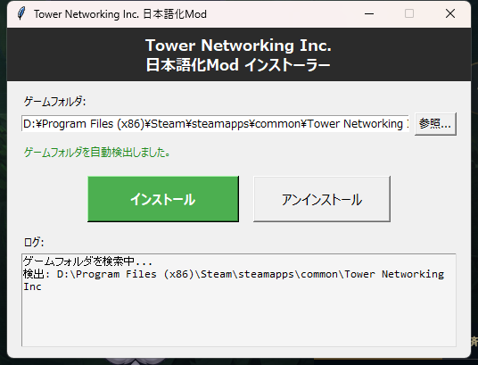

# Tower Networking Inc. 日本語化Mod

Steamゲーム「[Tower Networking Inc.](https://store.steampowered.com/app/2832740/Tower_Networking_Inc/)」の非公式日本語翻訳Modです。

ゲーム内テキストの約97%（3029/3108エントリ）を日本語に翻訳しています。

## インストール方法

### GUIインストーラー（推奨）

1. [Releases](../../releases) から `TNI_JapaneseMod_Installer.exe` をダウンロード
2. ダブルクリックで実行
3. ゲームフォルダが自動検出されるので「インストール」をクリック
4. ゲームを起動し、設定から言語を「日本語」に変更



### 手動インストール

1. `ja.po` をダウンロード
2. ゲームのインストールフォルダ内の `localizations/ja.po` を上書き
   - 通常のパス: `C:\Program Files (x86)\Steam\steamapps\common\Tower Networking Inc\localizations\`
3. ゲームを起動し、設定から言語を「日本語」に変更

## アンインストール

- **GUIインストーラーの場合:** インストーラーを再度起動し「アンインストール」をクリック
- **手動の場合:** Steamでゲームを右クリック → プロパティ → インストール済みファイル → ゲームファイルの整合性を確認

## 翻訳対象

| カテゴリ | 内容 |
|---|---|
| UI全般 | メニュー、設定画面、ボタン等 |
| ゲームプレイ | チュートリアル、ヒント、イベント通知 |
| Netshコマンド | 全ルーチンのヘルプテキスト |
| Wiki/ヘルプ | ネットワーク概念、機器説明、アプリ使い方 |
| D-Market | デバイス説明、サービス説明 |
| シナリオ | 提案テキスト、SLA通知、脅威情報 |

## 注意事項

- 非公式の有志翻訳です
- ゲームのアップデートにより翻訳が上書きされる場合があります。その際は再インストールしてください
- 未翻訳のエントリはゲーム内テスト用文字列（foobar等）のみです

## ビルド方法（開発者向け）

翻訳スクリプトから `ja.po` を生成する場合:

```bash
python translate.py
```

GUIインストーラーの `.exe` をビルドする場合:

```bash
pip install pyinstaller
cd release
pyinstaller --onefile --windowed --name "TNI_JapaneseMod_Installer" --add-data "ja.po;." installer.py
```
